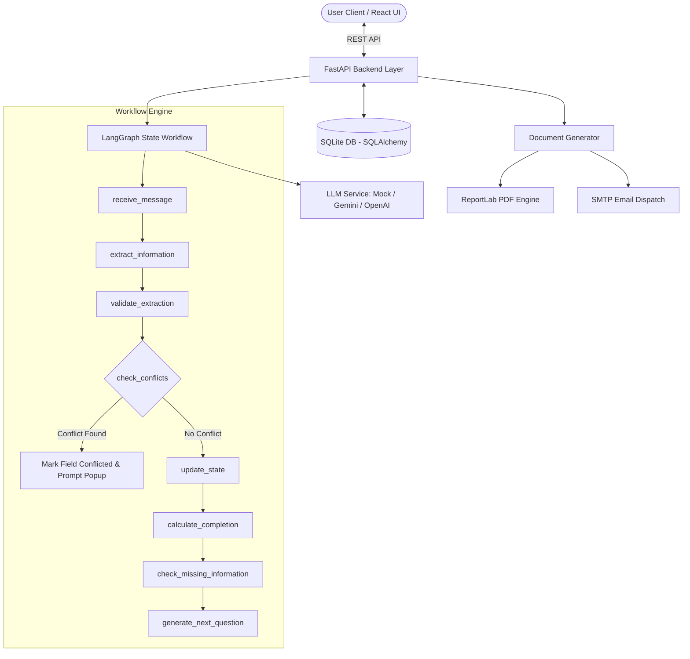

# Document Intake Assistant

**Candidate:** Gauri Nitin Gulhane  
**Technical Test:** LLM Application  
**Repository:** [github.com/gaurigulhane/Document_Intake_Assistant](https://github.com/gaurigulhane/Document_Intake_Assistant)  
**Deadline:** September 2026  

---

## 1. Project Overview

**Document Intake Assistant** is an LLM-powered web application that conducts a multi-turn conversational interview, maintains validated structured state separately from conversation logs, detects and resolves data contradictions, tracks document completeness progress in real time, and produces a draft **Personal Wishes Document** with PDF export and email dispatch services.

> ⚠️ **Mandatory Legal Disclaimer:**  
> **FICTIONAL DOCUMENT — NOT LEGAL ADVICE**. This application is an engineering demonstration created for technical evaluation and does not constitute legal advice or a binding legal instrument.

---

## 2. Standout Features & Highlights

- **Multi-Turn Conversational Interview**: Conducts structured intake asking targeted follow-up questions for missing fields without repeating captured information.
- **Structured State as Source of Truth**: `WishesState` schema is the single source of truth; conversation logs are strictly partitioned from state fields.
- **Conflict Detection & Interactive Resolution**: Contradictory statements (e.g. declaring no children, then naming a daughter) trigger interactive resolution popups (`Keep Previous` vs `Use New Value`).
- **Confirmation Status Tracking**: Tracks confirmation status (`confirmed`, `needs_confirmation`, `conflicted`, `captured`, `unknown`) for every field.
- **Live Completeness Progress Bar**: Real-time completeness tracking ($0\% - 100\%$) indicating when the document is ready for export.
- **Direct UI Field Editing (`PATCH`)**: Users can click `[Edit]` beside any field in the live sidebar preview to directly update values without chatting.
- **PDF Export Engine (`ReportLab`)**: Generates downloadable, stylized PDF exports of the Personal Wishes Document.
- **SMTP Email Dispatch Service**: Optional email sending service attaching the generated PDF to a user-specified email address.
- **Pluggable Dual LLM Architecture**: Switch between an offline **Deterministic Mock LLM Provider** and live LLM providers (Google Gemini / OpenAI / Anthropic).
- **Modern React 18 + Vite Frontend**: Responsive 2-panel split interface built with Lucide icons and dark glassmorphic styling.
- **Automated Testing Suite**: 100% passing Pytest suite (`8/8 tests`) covering extraction, state updates, conflicts, document generation, and PDF export.
- **Docker Support**: Containerized multi-stage build (`Dockerfile` & `docker-compose.yml`) for 1-command deployment.
- **Postman API Collection**: Ready-to-import Postman JSON collection (`postman/Document-Intake-Assistant.json`).

---

## 3. Architecture & Workflow Diagram



---

## 4. Technology Stack

| Layer | Technology |
| :--- | :--- |
| **Frontend** | React 18, Vite, Lucide React Icons, Vanilla CSS Design System |
| **Backend** | Python 3.11/3.13, FastAPI, Uvicorn |
| **LLM Orchestration** | LangChain, LangGraph State Engine |
| **Data Validation** | Pydantic v2 |
| **Database** | SQLite, SQLAlchemy ORM |
| **PDF Generation** | ReportLab |
| **Email Service** | Python `smtplib` / `email.mime` |
| **Testing** | Pytest, HTTPX TestClient |
| **Containerization** | Docker, Docker Compose |

---

## 5. Repository Structure

```
Document_Intake_Assistant/
│
├── backend/
│   ├── app/
│   │   ├── api/
│   │   │   ├── endpoints/
│   │   │   │   ├── sessions.py
│   │   │   │   ├── state.py
│   │   │   │   ├── conflicts.py
│   │   │   │   ├── document.py
│   │   │   │   └── email.py
│   │   │   └── router.py
│   │   ├── graph/
│   │   │   └── workflow.py       # LangGraph state machine
│   │   ├── llm/
│   │   │   ├── mock_provider.py  # Fallback deterministic provider
│   │   │   └── service.py        # LangChain & LLM provider wrapper
│   │   ├── models/
│   │   │   ├── database_models.py
│   │   │   └── pydantic_models.py
│   │   ├── services/
│   │   │   ├── document_generator.py
│   │   │   ├── pdf_exporter.py
│   │   │   └── email_service.py
│   │   ├── config.py
│   │   ├── database.py
│   │   └── main.py               # FastAPI entrypoint
│   │
│   ├── tests/                    # Automated pytest suite
│   │   ├── conftest.py
│   │   ├── test_extraction.py
│   │   ├── test_state.py
│   │   ├── test_conflicts.py
│   │   ├── test_document.py
│   │   ├── test_pdf.py
│   │   └── test_api.py
│   │
│   └── requirements.txt
│
├── frontend/
│   ├── src/
│   │   ├── api/
│   │   │   └── client.js
│   │   ├── components/
│   │   │   ├── ChatInterface.jsx
│   │   │   ├── LiveStatePreview.jsx
│   │   │   ├── ConfirmationBadge.jsx
│   │   │   ├── CompletionProgressBar.jsx
│   │   │   ├── ConflictModal.jsx
│   │   │   ├── DirectEditModal.jsx
│   │   │   ├── DocumentPreviewModal.jsx
│   │   │   └── EmailModal.jsx
│   │   ├── App.jsx
│   │   ├── App.css
│   │   ├── index.css
│   │   └── main.jsx
│   ├── package.json
│   └── vite.config.js
│
├── docs/
│   └── AI_LOG.md                # Candidate AI development log
│
├── postman/
│   └── Document-Intake-Assistant.json
│
├── Dockerfile
├── docker-compose.yml
├── .dockerignore
├── .env.example
├── .gitignore
├── LICENSE
└── README.md
```

---

## 6. Setup & Execution Instructions

### Option A: Running with Docker (Recommended)

```bash
# Clone the repository
git clone https://github.com/gaurigulhane/Document_Intake_Assistant.git
cd Document_Intake_Assistant

# 1-Command Build & Run:
docker-compose up --build
```
Access the application at: **`http://localhost:8000`**

---

### Option B: Running Locally (Backend + Frontend)

#### 1. Environment Configuration
```bash
cp .env.example .env
```

#### 2. Backend Setup
```bash
cd backend
pip install -r requirements.txt
uvicorn app.main:app --reload --port 8000
```
Backend API will run at: `http://localhost:8000`  
Swagger API Docs available at: `http://localhost:8000/docs`

#### 3. Frontend Setup
In a separate terminal:
```bash
cd frontend
npm install
npm run dev
```
Open your browser at: **`http://localhost:5173`**

---

## 7. Automated Testing Suite

To execute the automated Pytest suite:

```bash
cd backend
python -m pytest
```

All **8 unit & integration tests** validate:
- Natural language entity extraction (single & multi-field extraction).
- Target-field scoping and ambiguity handling.
- Completion progress calculation ($0\% - 100\%$).
- Direct state updates via `PATCH` API.
- Contradiction detection and explicit conflict resolution.
- Draft document generation with disclaimer labels.
- ReportLab PDF byte stream output.

---

## 8. API Endpoint Reference

| Method | Endpoint | Description |
| :--- | :--- | :--- |
| `POST` | `/api/sessions` | Create session & start conversation |
| `GET` | `/api/sessions/{id}` | Get session details & chat history |
| `POST` | `/api/sessions/{id}/messages` | Send user message & run LangGraph workflow |
| `GET` | `/api/sessions/{id}/state` | Fetch structured state & completion % |
| `PATCH` | `/api/sessions/{id}/state` | Directly edit a structured field |
| `GET` | `/api/sessions/{id}/conflicts` | List unresolved & resolved conflicts |
| `POST` | `/api/sessions/{id}/conflicts/{c_id}/resolve` | Resolve conflict (`keep_old` / `use_new`) |
| `POST` | `/api/sessions/{id}/document` | Generate draft Personal Wishes Document |
| `GET` | `/api/sessions/{id}/document/pdf` | Export & download PDF file |
| `POST` | `/api/sessions/{id}/email` | Dispatch generated PDF via email |

---

## 9. Production & Security Roadmap

1. **Authentication & Authorization**: Implement OAuth2 / JWT authentication to secure session endpoints.
2. **Database Persistence**: Transition SQLite in-memory/file storage to PostgreSQL with encrypted PII storage.
3. **Prompt Injection Guardrails**: Implement input validation filters before routing user messages to LLM nodes.
4. **LLM Observability**: Integrate LangSmith or Arize Phoenix for cost monitoring and trace evaluation.
